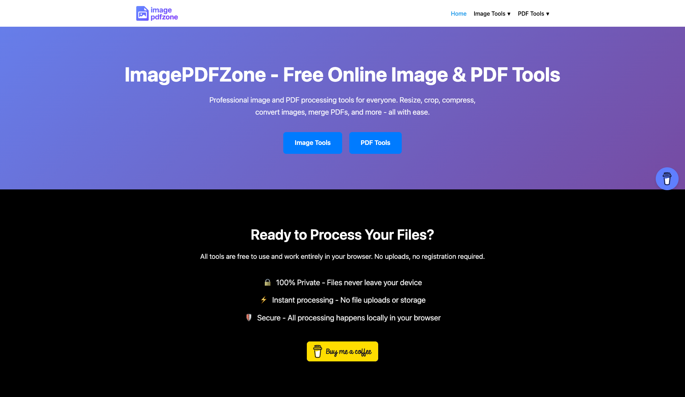

# ImagePDFZone

A comprehensive web application providing free online image and PDF processing tools. All processing happens locally in your browser, ensuring complete privacy and security.

## 🌟 Features

### Image Tools

#### Resize & Transform

- **Image Resizer** - Resize images to specific dimensions
- **Image Cropper** - Crop images to desired aspect ratios
- **Image Rotate & Flip** - Rotate and flip images
- **Add Watermark** - Add text or image watermarks

#### Compression

- **JPG Compressor** - Reduce JPG file sizes
- **PNG Compressor** - Optimize PNG files
- **WebP Compressor** - Compress WebP images
- **BMP Compressor** - Compress BMP files
- **HEIC Compressor** - Compress HEIC images

#### Conversion

- **JPG Converter** - Convert to JPG format
- **PNG Converter** - Convert to PNG format
- **JPEG Converter** - Convert to JPEG format
- **WebP Converter** - Convert to WebP format
- **GIF Converter** - Convert to GIF format

### PDF Tools

- **PDF Compressor** - Reduce PDF file sizes
- **Merge PDF** - Combine multiple PDFs
- **Split PDF** - Split PDFs into separate pages
- **Image to PDF** - Convert images to PDF documents

## 🔒 Privacy & Security

- **100% Private** - Files never leave your device
- **No Uploads** - All processing happens locally
- **No Registration** - Use immediately without signing up
- **Secure** - Client-side processing only

## 🌐 Live Site

Visit [ImagePDFZone](https://imagepdfzone.netlify.app/)

## ☕ Support

If you find this project helpful, consider buying me a coffee to support development:

